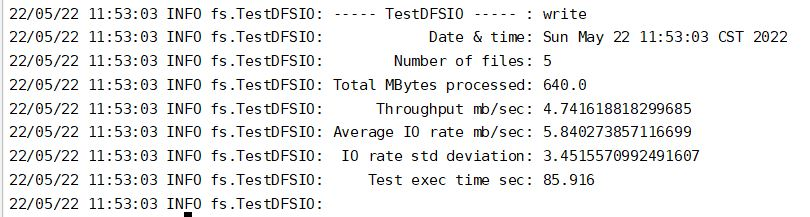

# in 2019 -纪念大一写的屎山代码

虽然但是，还是说明一下吧,
兄弟们留个star⭐吧

> ## app/src/main/java/com/example/ITwords :源代码。
> ## ocr_ui文件夹:百度OCR图文识别工程模块

## 一些功能：
> * 图文识别，联网翻译，可选择IT词意风格翻译、IT词库实时匹配推荐

> * 提供APP外部文本选中文本，跳转到本APP翻译。

> * 提供单用户词汇答题训练功能，已经多用户词汇比拼、分数打榜功能。

> * 搜集对前一日用户对词汇的操作数据，通过后台计算每日更新出《推荐词汇》给所有用户。

> * 多用户模式，用户间单独词库与总词库隔离，且提供词库私有化，与从
其他用户词库获取单词。

> * 用户可发帖，并可点赞，举报。

> * 设置如QQ、网页等外部跳转分享。

## 一些设计：

当然服务器太贵现在早已关掉了

--------

> * 采用本地 SQLite库 + 远程服务总库模式，离线状态，将记录数据操作原语，下次联网时，做到数据无缝衔接。本地数据库保证UI操作流畅。

>* 在与用户的交互事件中，设下数据埋点，通过Flume 实时采集数据，到服务器的HDFS中。

>* 对服务器设置每日定时任务，通过Mapreduce离线计算用户数据来向所有用户推送当日最热门的一些词汇。

------------
## 一些界面：
 

 
 

 
 

-------

## 一些设计图

----------------

## 一些非常不严谨的测试（图一乐）

--------------------------
